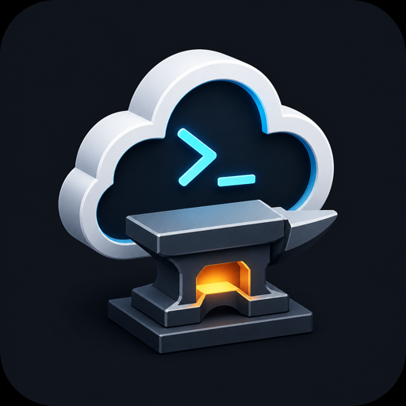

<p align="center">
  
</p>

<h1 align="center">Cloud Forge CLI</h1>

Cloud Forge CLI is the command-line client for the Cloud Forge catalog. The current foundation supports catalog search, app inspection, template download, and AWS CloudFormation deployment.

## What It Does

Cloud Forge CLI helps you discover and deploy apps from the Cloud Forge catalog.

For AWS, it can:

- search available apps
- show app metadata
- render the CloudFormation template for an app
- create or update an AWS CloudFormation stack
- show CloudFormation resource progress while deploying
- reuse a local SSH key for EC2 access
- print stack outputs such as service URL, public IP, instance ID, AMI ID, and region when the template provides them

AWS deploys default to `us-east-1`.

## Install

Download a release archive for your operating system from:

```text
https://github.com/CoreNovaLabs/cloud-forge-cli/releases
```

Unpack it and put the `cloud-forge` binary somewhere on your `PATH`.

Verify the install:

```bash
cloud-forge version
```

You can also build from source. See [Build From Source](#build-from-source).

## AWS Credentials

Cloud Forge CLI uses the AWS SDK for Go v2 for AWS API calls. Browser sign-in can use AWS CLI v2's `aws login` when it is installed locally.

You do not need to install the AWS CLI, but you do need AWS credentials.

Use the built-in AWS auth wizard:

```bash
cloud-forge auth aws
```

The wizard first checks whether existing AWS credentials work. If no valid credentials are found, it offers two options:

- browser sign-in: opens an AWS sign-in page and configures a local temporary-credential profile after authorization
- access keys: prompts for an AWS access key ID and secret access key, then writes AWS SDK-compatible files

The browser sign-in path currently uses AWS CLI v2's `aws login` capability when it is installed locally. If the browser does not open, AWS prints a sign-in URL that you can copy into a browser. If `aws login` is not available, use the access key option.

If `AWS_PROFILE` is set, the auth wizard uses that profile by default. Use `--profile NAME` to check or write a specific profile.

Check current auth status:

```bash
cloud-forge auth aws status
```

The status output includes the AWS account, ARN, region, profile, and AWS SDK credential source.

Supported credential sources include:

- `~/.aws/credentials`
- `~/.aws/config`
- `AWS_ACCESS_KEY_ID` and `AWS_SECRET_ACCESS_KEY`
- `AWS_PROFILE`
- AWS SSO or assume-role profiles supported by the AWS SDK
- EC2/ECS instance or task roles

Example with an AWS profile:

```bash
export AWS_PROFILE=default
```

Example with environment variables:

```bash
export AWS_ACCESS_KEY_ID="..."
export AWS_SECRET_ACCESS_KEY="..."
```

AWS deploys default to `us-east-1`; override it when needed:

```bash
cloud-forge deploy hello-nginx --cloud aws --region us-west-2
```

For production use, prefer an IAM user or role with limited permissions instead of using the AWS account root credentials.

Force browser sign-in:

```bash
cloud-forge auth aws --method browser
```

Force manual access key configuration:

```bash
cloud-forge auth aws --method access-key
```

## Quick Start

Search the catalog:

```bash
cloud-forge search nginx --cloud aws
```

Show an app:

```bash
cloud-forge show hello-nginx
```

Preview the AWS template:

```bash
cloud-forge template hello-nginx --cloud aws
```

Validate a deployment without creating resources:

```bash
cloud-forge deploy hello-nginx --cloud aws --dry-run
```

Deploy to AWS:

```bash
cloud-forge deploy hello-nginx --cloud aws \
  --stack-name cloud-forge-hello-nginx \
  --instance-type t3.micro \
  --allowed-ip 1.2.3.4/32
```

During deployment, the CLI prints CloudFormation progress:

```text
[12:01:08] AWS::EC2::SecurityGroup HelloSecurityGroup CREATE_COMPLETE
[12:01:15] AWS::EC2::Instance HelloInstance CREATE_IN_PROGRESS
```

When the stack completes, the CLI prints the outputs returned by the template.

## SSH Key Behavior

By default, AWS deploys use a local reusable SSH key:

```text
~/.cloud-forge/keys/aws/cloud-forge-default.pem
```

The CLI creates this private key on first use with `0600` permissions and imports the public key into EC2 as `cloud-forge-default` when the target AWS region does not already have that key pair. The same local private key is reused across regions.

Use an existing EC2 key pair instead:

```bash
cloud-forge deploy hello-nginx --cloud aws \
  --key-name my-key
```

Disable SSH key injection:

```bash
cloud-forge deploy hello-nginx --cloud aws \
  --ssh-key none
```

Use a custom local private key path:

```bash
cloud-forge deploy hello-nginx --cloud aws \
  --ssh-key-path ~/.cloud-forge/keys/aws/custom.pem
```

## Cleanup

Cloud Forge CLI v0.1.0 creates or updates stacks, but it does not yet provide a `delete` command.

To remove a deployment, delete the CloudFormation stack in the AWS Console.

If you use the AWS CLI, the equivalent command is:

```bash
aws cloudformation delete-stack --region us-east-1 --stack-name cloud-forge-hello-nginx
```

Deleting the stack removes the EC2 instance, Elastic IP, security group, and related stack resources created by the template.

The reusable local private key is not deleted automatically:

```text
~/.cloud-forge/keys/aws/cloud-forge-default.pem
```

## Common Options

```bash
cloud-forge deploy hello-nginx --cloud aws \
  --region us-east-1 \
  --stack-name cloud-forge-hello-nginx \
  --instance-type t3.micro \
  --allowed-ip 1.2.3.4/32 \
  --progress plain
```

Disable progress output:

```bash
cloud-forge deploy hello-nginx --cloud aws \
  --progress none
```

Template parameters can be passed either with dedicated flags or repeated `--param` flags:

```bash
cloud-forge deploy gitea --cloud aws \
  --region us-east-1 \
  --param KeyName=my-key \
  --param ImageId=ami-0123456789abcdef0
```

Supported dedicated AWS parameter flags include `--instance-type`, `--key`, `--key-name`, `--ssh-key`, `--ssh-key-path`, `--progress`, `--domain`, `--hosted-zone-id`, `--disk-size`, `--vpc`, `--subnet`, `--allowed-ip`, `--image-id`, and `--latest-ami-id`.

## Catalog Reference

By default the CLI reads:

```text
https://cdn.jsdelivr.net/gh/CoreNovaLabs/cloud-forge-catalog@main/index/apps.json
```

If the default mirror is unavailable, the CLI falls back to the GitHub raw catalog URL.

For local development:

```bash
export CLOUD_FORGE_STORE_URL="file:///absolute/path/to/cloud-forge-catalog/index/apps.json"
```

## Command Reference

```bash
cloud-forge search hello --cloud aws
cloud-forge auth aws status
cloud-forge show hello-nginx
cloud-forge template hello-nginx --cloud aws
cloud-forge deploy hello-nginx --cloud aws --dry-run
```

## AWS Deploy

AWS deployment uses the AWS SDK for Go v2 and CloudFormation. It does not shell out to the AWS CLI.

Credentials are loaded from the normal AWS SDK chain. AWS deploys default to `us-east-1`; override with `--region` when needed.

```bash
export AWS_PROFILE=default
```

Validate a template without creating resources:

```bash
cloud-forge deploy hello-nginx --cloud aws --dry-run
```

Create or update a stack:

```bash
cloud-forge deploy hello-nginx --cloud aws \
  --stack-name cloud-forge-hello-nginx \
  --instance-type t3.micro \
  --allowed-ip 1.2.3.4/32
```

By default, deploy waits print CloudFormation resource events as plain progress lines:

```text
[12:01:08] AWS::EC2::SecurityGroup HelloSecurityGroup CREATE_COMPLETE
[12:01:15] AWS::EC2::Instance HelloInstance CREATE_IN_PROGRESS
```

Disable progress output:

```bash
cloud-forge deploy hello-nginx --cloud aws \
  --progress none
```

## Telemetry

The CLI sends anonymous, non-blocking usage events to:

```text
https://telemetry.corenovacloud.com/v1/events
```

Telemetry does not include cloud credentials, account IDs, domains, local paths, or template parameter values.

Disable it when needed:

```bash
export CLOUD_FORGE_TELEMETRY=0
```

Use a different endpoint for local testing:

```bash
export CLOUD_FORGE_TELEMETRY_ENDPOINT="http://127.0.0.1:8787/v1/events"
```

## Build From Source

```bash
go build ./cmd/cloud-forge
```

## Development

```bash
go test ./...
```
